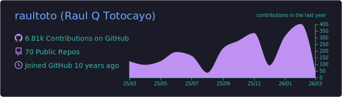
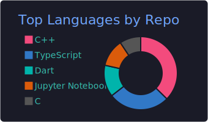
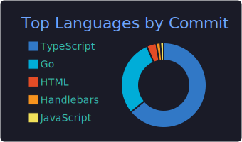
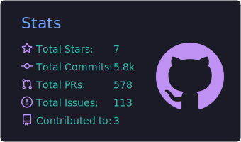
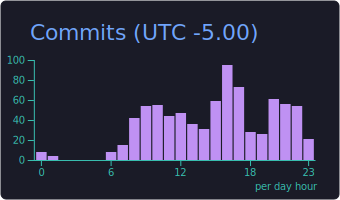

## Hey, I'm Raul

Backend Software Engineer focused on scalable systems and clean architecture.  
I build tools and products that solve real developer problems — then open source them.

Writing about software at **[codeandbeyond.blog](https://codeandbeyond.blog)** and **[Medium](https://medium.com/@raultotocayo)**

---

### Currently Building

<table>
<tr>
<td width="100%" valign="top">

**[TableHub](https://www.tablehub.pro)** — A fast, modern, cross-platform SQL client for developers.  
Connect to PostgreSQL and more from a single, beautiful interface.  
Native apps for macOS, Windows, and Linux. 

`<20ms query speed` · `10+ databases` · `ER diagrams` · `Smart autocomplete`

</td>
</tr>
</table>

---

### Tech Stack

**Languages**

**Architecture & Data**

**DevOps**

---

### Featured Open Source

<table>
<tr>
<td width="50%" valign="top">

#### <a href="https://github.com/raultoto/mongo-patterns">mongo-patterns</a>

MongoDB repository pattern implementation with TypeScript. Clean abstraction layer over MongoDB operations following DDD principles — focus on business logic, not query plumbing.

</td>
<td width="50%" valign="top">

#### <a href="https://github.com/raultoto/postman-alchemy">postman-alchemy</a>

Automatic Postman collection generator and test automation from OpenAPI specs and GraphQL schemas. Zero manual work from API definition to ready-to-use collections.

</td>
</tr>
</table>

| Package | What it does | |
|---|---|---|
| [grpc-powerkit](https://github.com/raultoto/grpc-powerkit) | gRPC server framework with TypeScript decorators |  |
| [state-machine-manager](https://github.com/raultoto/state-machine-manager) | State machine for complex backend workflows |  |
| [quick-logger-js](https://github.com/raultoto/quick-logger-js) | High-performance logger inspired by NestJS |  |
| [error-codes-manager](https://github.com/raultoto/error-codes-manager) | Structured error code management for TS/JS |  |

---

### GitHub Stats

  

  
  

  
  

---

  
  
  

